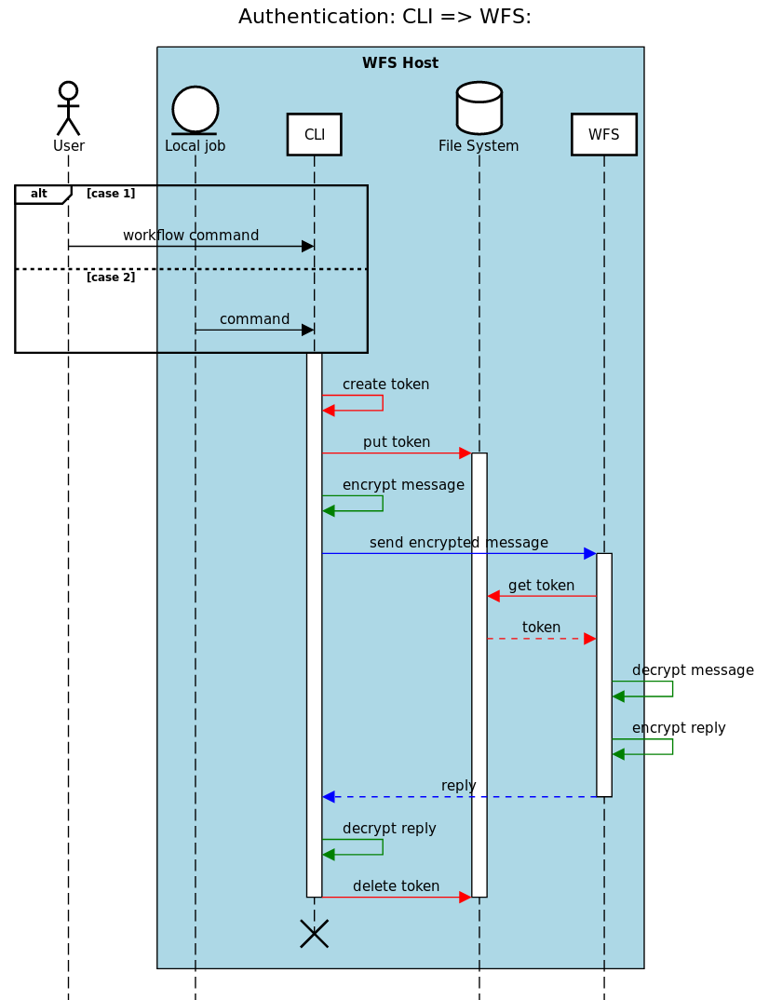

# Proposal for Authentication between the CLI & the Workflow Service

#### Acronyms used:

* CLI == command line interface;
* WFS == workflow ('suite' in Cylc <=7 terminology) service;
* UIS == UI (user interface) server.

## Proposal summary

**For command-to-workflow-service (CLI-to-WFS) authentication, use:**

1. for the (*conditional* [:star:]) *user, i.e. interactive,
   CLI*: **one-time tokens**, as in Diagram 1 [:eight_pointed_black_star:].
2. *for task-jobs* (call them just 'jobs' henceforth):
    1. *local (non-remote)* jobs: **one-time tokens as above**
       (Diagram 1 [:eight_pointed_black_star:]), accessible via the local
       file system;
    2. *remote* jobs on a non-shared file-system: **event-driven "one-job"
       tokens**, i.e. a single token for every job, lasting, & being valid
       only, for the duration of the job, as in
       Diagram 2 [:eight_spoked_asterisk:].
3. *user CLI that is not invoked under the conditions of (1)*[:star:]: **out of
   scope**, but in the future may be supported to go through the UIS.

[:star:]: conditions of the above user CLI distinction:
* user is logged in (authenticated);
* user is the workflow owner;
* user has full access to the file system where the WFS is running;
* the WFS is running as this user.

One-job tokens would require one of the following (or some other alternative):

  * another file per job, which is not ideal as it adds to the file count;
  * a shared combined file containing tokens for all jobs per workflow;
  * extending an existing job file such as the 'job.status' so that such
    files also carry the token information for each job, & preventing that
    information from being displayed in Cylc Review.

Decisions on implementation details, such as modules & standards to use,
await the go-ahead on an approach, the above one or otherwise.

## UML Sequence Diagrams

<!---
These diagrams are generated using the tool at https://sequencediagram.org/

The code to generate these directly from the tool are included in comments
below, so anyone that would like to make edits can do so easily.
-->

#### Key for interaction arrow colours:

* Black: *initiating* interaction
* Red: *token-related* interaction or process
* Green: *en- or de-cryption* process
* Blue: generic message or communication
* Purple: *batch scheduling* interaction or process

### Conditional User & Local Job CLI (CLI => WFS)

*Diagram 1* [:eight_pointed_black_star:]:

<!---
title Authentication: CLI => WFS

actor User
participantgroup #lightblue **WFS Host**
entity Local job
participant CLI
alt case 1
User->CLI: workflow command
else case 2
Local job->CLI: command
end
database File System
participant WFS
activate CLI
CLI-#red>CLI: create token
CLI-#red>File System: put token
activate File System
CLI-#green>CLI: encrypt message
CLI-#blue>WFS: send encrypted message
activate WFS
WFS-#red>File System: get token
File System--#red>WFS: token
WFS-#green>WFS: decrypt message
WFS-#green>WFS: encrypt reply
WFS--#blue>CLI: reply
deactivate WFS
CLI-#green>CLI: decrypt reply
CLI-#red>File System: delete token
deactivate File System
deactivate CLI
destroyafter CLI
end
-->

### Remote Jobs (WFS => Remote Job => WFS)

*Diagram 2* [:eight_spoked_asterisk:]:

<!---
title Authentication: WFS <=> Remote Job

participantgroup #lightblue **WFS Host**
participant WFS
end
participantgroup #lightyellow **Remote Job Host**
participant Job Submit
database File System
participant Batch System
entity Remote Job
end
WFS-#blue>Job Submit: SSH
activate WFS
activate Job Submit
Job Submit-#red>Job Submit: create token
Job Submit-#red>File System: put token
activate File System
File System--#blue>Job Submit: write OK
Job Submit-#purple>Batch System: submit
activate Batch System
Batch System--#purple>Job Submit: return
Job Submit--#red>WFS: return with token
deactivate Job Submit
destroyafter Job Submit
Batch System-#purple>Remote Job: start job
deactivate Batch System
activate Remote Job
Remote Job-#red>File System: get token
File System--#blue>Remote Job: read OK
Remote Job-#blue>WFS: message started/completed
deactivate WFS
Remote Job-#red>File System: delete token
deactivate File System
deactivate Remote Job
destroyafter Remote Job
-->

## Further information

### Context

Cylc 8 discussions have converged (as described briefly
[here](../cylc-8-architecture#command-line-interface) &
[here](../cylc-8-tasks#general-authentication-issues-sujata-hilary--damian-and-martin-)
on usage of tokens for authentication between the CLI & the workflow
service. Both of the following token approaches have been raised as potential
solutions:

* "one-time" tokens: single-use tokens i.e. ones that are created then deleted
  once they are no longer required, with fine (process) granularity for
  creation/deletion;
* "timed" tokens: tokens that expire after a set time period.

Due e.g. to the new architecture, task-job clients must be distinguished &
treated differently from user CLI clients, unlike for the
[simple passphrase-based approach of Cylc 7](../cylc-7-architecture#authentication).
Note 'passphrase' is the term used here, but it is not in fact a
user-specified passphrase, but a one-time token valid for the lifetime of the suite (though
users can set their own choice of passphrase, but that is very rare).

We also want to make sure the new approach offers increased security, rather
than just being a "rebrand" accounting for the new architecture, to the
Cylc 7 approach.

We should keep in mind the following points:

* In the longer-term future, remote jobs are likely to run on cloud platforms;
* Later work on authorisation may rely on a mapping against tokens, so
  we should not preclude that.

### An alternative to consider

Another idea that was raised was to instead have one token *per host* for
job clients i.e. a timed token per remote job platform. Different platforms
have different security levels & this approach could benefit from that.

We could do some preliminary investigation to understand whether having
one token *per job* or one *per host* would be better for job clients?
