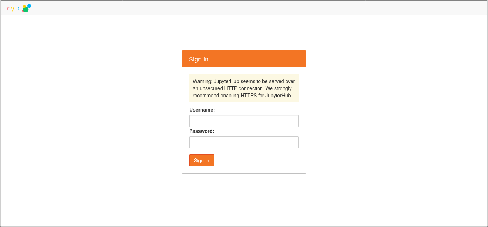
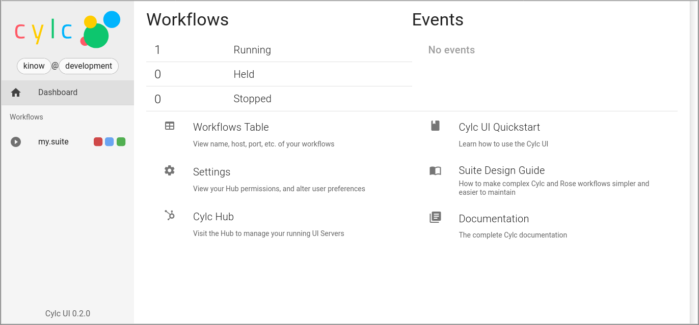
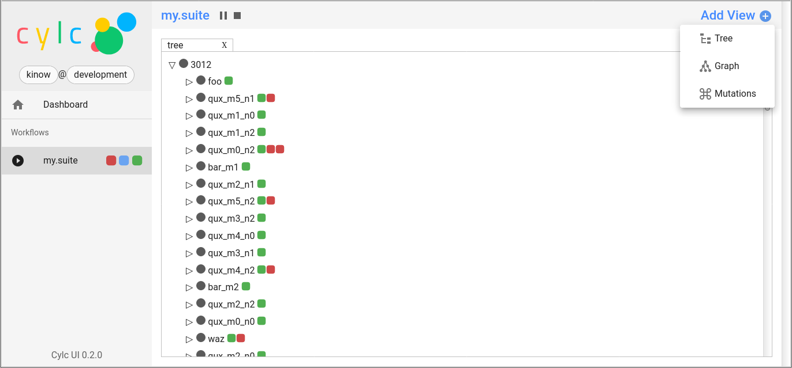
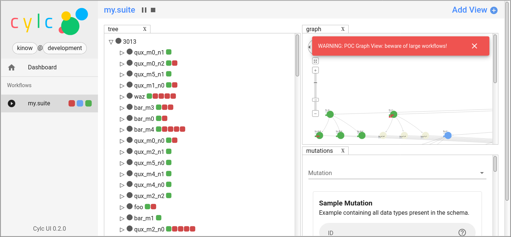
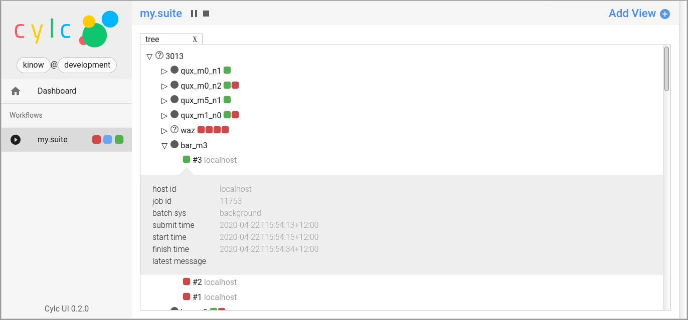
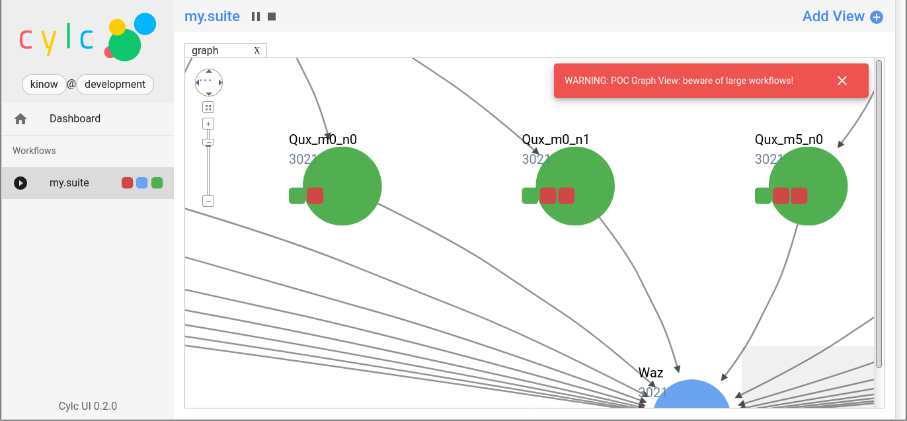
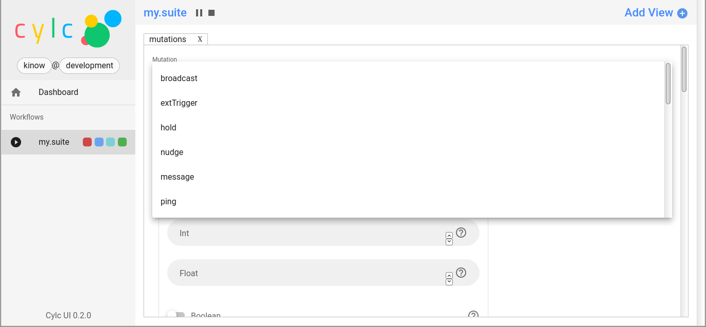
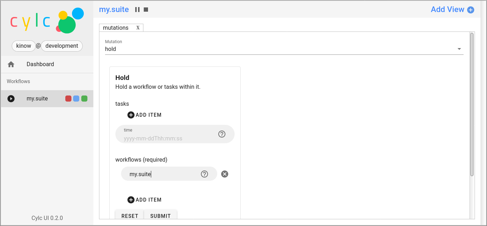
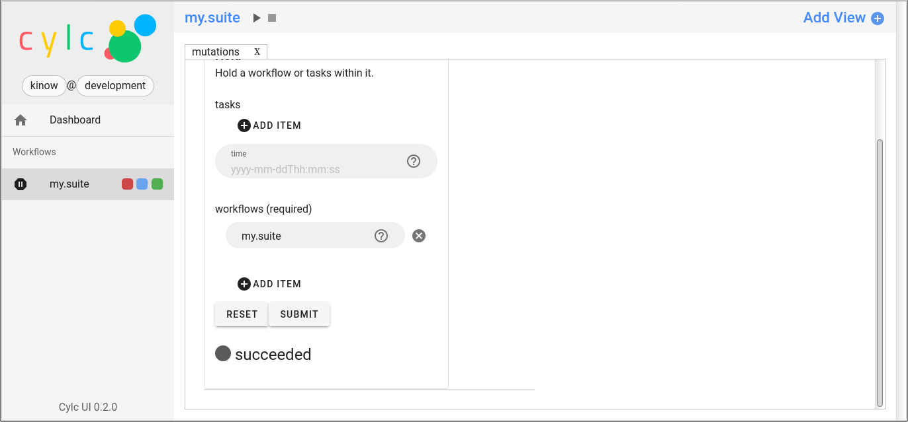

# Cylc 8 alpha2

Date: July 2020.

The second “alpha” preview release of Cylc 8 is available for testing by
interested users.

**NOTE this is not a production-ready release.**

Feel free to reach us at [Discourse](https://cylc.discourse.group/) if you have
questions, or create issues or pull requests via [GitHub](https://github.com/cylc/),
should you find any bugs or would like to suggest new features for Cylc 8.

We encourage users who have successfully tested this release to send a
short message on Discourse to let us know how was the installation process,
any issues found with this release, or anything that we could use to
improve future releases.

<!-- https://ecotrust-canada.github.io/markdown-toc/ -->
* [Installation instruction](#installation-instruction)
  + [Conda](#conda)
  + [pip](#pip)
  + [Testing the installation](#testing-the-installation)
  + [Usage](#usage)
* [Current Limitations](#current-limitations)
* [What's new](#whats-new-since-cylc-80a1)
* [Task Job Access to Cylc 8](#task-job-access-to-cylc-8)

## Installation instructions

The minimum requirements for Cylc 8 are:

- Python 3.7 or 3.8
- Linux (some developers have experimented with MacOS and FreeBSD,
but there is no official support for those environments yet)
- A modern web browser if using the Cylc web UI

The Cylc 8 complete system includes:

- cylc-flow-8.0a2 - Python 3 Workflow Service, CLI, and terminal UI
- cylc-uiserver-0.2 - Python 3 UI Server component of the Cylc 8 architecture
- cylc-ui-0.2 - Vue.js web UI
- JupyterHub 1.+ - authenticates users and launches their Cylc UI Servers
- configurable-http-proxy - node.js proxy
- *(and all software dependencies of the above)*

### Conda

Use Conda to install the whole Cylc 8 system, including the web UI.

```bash
# optional conda environment
conda create -n cylc1
conda activate cylc1

# then install Cylc metapackage
conda install cylc
```

You can review the Conda [cylc metapackage
here](https://github.com/conda-forge/cylc-feedstock).
It will install the required Conda dependencies for Cylc 8, such as Cylc Flow,
Cylc UI Server, and Cylc UI.

### pip

You can use `pip` to install just the Python parts of Cylc 8.

- `pip install cylc-flow==8.0a2`
- `pip install cylc-uiserver=0.2`

Workflows can be executed using just the scheduler and CLI or terminal UI, but
if you want to try to web UI and can't use `conda` (above), you can now install
the web UI manually:

- Download the 0.2 release of Cylc UI ad unzip in a directory accessible to
Python (watch out for SELinux)
- Configure your `jupyterhub_config.py` using this
[Cylc UI example file](https://github.com/cylc/cylc-uiserver/blob/master/jupyterhub_config.py)
(make sure to set the right location of Cylc UI)

### Testing the installation

Once you have installed Cylc 8, you should be able to run Cylc commands, e.g.:

- `cylc --version`
- `cylc run --no-detach my.suite`
- `cylc-uiserver --help`

### Usage

Start the Hub (JupyterHub gets installed with the Conda "cylc" package):

```bash
mkdir -p "${HOME}/srv/cylc/"  # the hub will store session information here
cd "${HOME}/srv/cylc/"
jupyterhub \
    --JupyterHub.spawner_class="jupyterhub.spawner.LocalProcessSpawner" \
    --JupyterHub.logo_file="${CONDA_PREFIX}/work/cylc-ui/img/logo.svg" \
    --Spawner.args="['-s', '${CONDA_PREFIX}/work/cylc-ui']" \
    --Spawner.cmd="cylc-uiserver"
```

Voilà 🎉. Go to h[http://localhost:8000](http://localhost:8000), log in to the
Hub with your local user credentials, and enjoy Cylc 8 alpha2!

- Start a workflow with the CLI ((\*)a
good example is shown at the end of this section)
- Log in at the Hub to authenticate and launch your UI Server



- Note that much of the UI Dashboard is not functional yet. The
functional links are:
  * Cylc Hub
  * Workflows Table (shows the alpha 1 listing of workflows)
  * Suite Design Guide (web link)
  * Documentation (web link)
- In the left side-bar, you will find the port of Cylc 7's GScan view,
showing your active workflows. Click on the workflow name to view your
running workflows.



- In the new workflow view:
  - add more views to the current UI using the “Add View” button (top right
    corner)





- In the tree view:
  - click on family names to see the list of task names
  - click on task names to see the list of task jobs
  - click on job icons to see the detail of a specific job



- **NOTE the graph view is experimental and may not be performant for large
  workflows**



- **NOTE the "mutations" view is for control command functionality that is not
  yet integrated with the main views.**
  - this is a proof-of-concept, intended to allow users to control
  workflows from the Web UI, and will change in future releases
  - choose a mutation using the first combo box item
  - fill the required fields (e.g. workflow name)
  - press submit and wait for the confirmation message (e.g. "succeeded", and if you
  held the workflow, for instance, on the GScan left-side component the
  workflow icon should now have a different icon)







To deactivate and/or remove the conda environment:

- `conda deactivate`
- `conda env remove -n cylc1`

*(\*) The following workflow generates a series of tasks
that initially fail before succeeding after a random
number of retries (this shows the new "Cylc 8 task/job
separation" nicely)*:

```
[cylc]
   cycle point format = %Y
   [[parameters]]
      m = 0..5
      n = 0..2
[scheduling]
   initial cycle point = 3000
   [[graph]]
      P1Y = "foo[-P1Y] => foo => bar<m> => qux<m,n> => waz"
[runtime]
   [[root]]
      script = """
         sleep 20
         # fail 50% of the time if try number is less than 5
         if (( CYLC_TASK_TRY_NUMBER < 5 )); then
           if (( RANDOM % 2 < 1 )); then
              exit 1
           fi
         fi"""
      [[[job]]]
         execution retry delays = 6*PT2S
```

## Current Limitations

Cylc-8.0a2 is a preview release with:
- A **Python 3** scheduler and CLI - fully functional
- A new web UI, still in progress, but usable
- A new terminal UI program `cylc tui`

It can run existing Cylc-7 workflows. However:
- It is not production-ready yet. In production, please use:
  - the latest cylc-7.9 release - with Python 2.7
  - the latest cylc-7.8 release - with Python 2.6
- Do not use it where security is a concern
  - we are still working on Cylc 8 and have not yet fully
    tested or documented its security characteristics
- The web UI includes "tree" and "graph" views, but note that:
  - it is not yet driven by efficient incremental data updates
  - it does not yet have virtual scrolling for large workflow performance
  - the graph view is a POC only and is likely to be replaced
  - control functionality is available from a temporary "mutation view" but is
    not yet integrated with the views
  - the task content displayed is different from Cylc 7. For instance, there
    is an explicit separation between "tasks" and "jobs" now.
- We are still working on the documentation for Cylc 8, stay tuned

## What's new since Cylc-8.0a1?

A lot has changed since the
[previous Cylc 8 alpha release](https://cylc.discourse.group/t/cylc-8-0a1-preview-release-via-conda/149).

- [https://github.com/cylc/cylc-flow/blob/master/CHANGES.md](https://github.com/cylc/cylc-flow/blob/master/CHANGES.md)
- [https://github.com/cylc/cylc-uiserver/blob/master/CHANGES.md](https://github.com/cylc/cylc-uiserver/blob/master/CHANGES.md)
- [https://github.com/cylc/cylc-ui/blob/master/CHANGES.md](https://github.com/cylc/cylc-ui/blob/master/CHANGES.md)

The following list highlights some of the major changes:

- Cylc Flow
  * new terminal UI, `cylc tui my.suite`, a modern and improved version of
   `cylc monitor` (now decommissioned) [cylc-flow #3463](https://github.com/cylc/cylc-flow/pull/3463)
  * Cylc Flow now supports plug-ins, allowing parts of the Cylc core
  to be extended by users [cylc-flow #3485](https://github.com/cylc/cylc-flow/issues/3485)
- Cylc UI Server
  * we have added GraphQL subscriptions to Cylc UI Server adding the server-side WebSocket support [cylc-uiserver #82](https://github.com/cylc/cylc-uiserver/pull/82)
- Cylc UI
  * the tree view now displays families [cylc-ui #291](https://github.com/cylc/cylc-ui/pull/291)
  * new GScan component showing the running workflows [cylc-ui #301](https://github.com/cylc/cylc-ui/pull/301)
  * WebSockets added to the client side, requesting GraphQL subscriptions [cylc-ui #280](https://github.com/cylc/cylc-ui/pull/280)
  * workflow view built with Lumino (same library as JupyterLab) allowing tabbed views
  (tree and graph at the moment) [cylc-ui #325](https://github.com/cylc/cylc-ui/pull/325)
  * a new component showing when the Cylc UI server is offline [cylc-ui #379](https://github.com/cylc/cylc-ui/pull/379)
- Conda installation
  * a new component for users to experiment with mutations [cylc-ui #339](https://github.com/cylc/cylc-ui/issues/339)
  (see linked issues)
  * We finished creating conda forge repositories for all our Python
  and JavaScript projects, as well as for a couple of dependencies of
  Cylc Flow. That means users can install Cylc 8 directly from Conda
  Forge with no extra steps required.

We have also implemented several fixes related to the [new
architecture](https://cylc.github.io/cylc-admin/cylc-8-architecture)
of Cylc 8, as well as other changes related to porting old GUI
features to the new Web UI, and many software dependency updates (for latest
features but also for security).

## Task Job Access to Cylc 8

Cylc task jobs need access to the same Cylc version that their parent
scheduler is running, e.g. for job status messaging. Users may even need
to run multiple workflows at once on a system with multiple Cylc releases
installed, and the task jobs of each need to call the correct Cylc.

Cylc 7 handles this via a wrapper script installed as `cylc` in the user's
executable search path (`$PATH`). The wrapper intercepts Cylc commands,
including `cylc message` from task jobs, and uses the environment to
determine the right Cylc in each case (the scheduler writes `$CYLC_VERSION`, for
example, to task job scripts).

Cylc 8 will use a similar wrapper (which has to deal with the additional
complication of Python and conda virtual environments) but we have not yet
documented this for users.

*For the moment we suggest you do not use a `cylc` wrapper for Cylc 8 testing,
and run only **local background jobs** because they inherit the scheduler's
virtual environment and will therefore find the right Cylc directly
without the help of a wrapper.* However, note the following warning.

**WARNING: if your `.bashrc` (or similar) provides access to a Cylc 7 `cylc`
wrapper by *prepending* its location to `$PATH`, that wrapper will override
Cylc 8 virtual environments and your Cylc 8 jobs will therefore be unable to
communicate status back to the scheduler. If so, disable the Cylc 7 wrapper
before testing Cylc 8.**

The next Cylc 8 release (alpha-3) will provide a backward-compatible wrapper to
handle Cylc 7 and 8 together on the same system.
